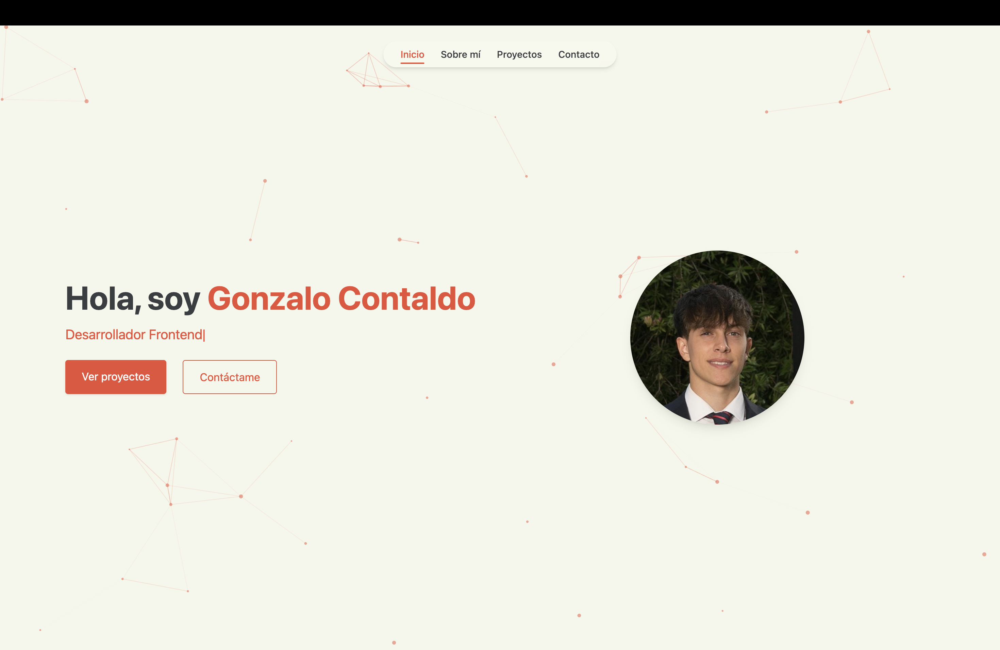

# 💼 Gonzalo Contaldo – Portfolio

Bienvenido a mi sitio personal, donde muestro quién soy, qué hago y algunos de los proyectos en los que he trabajado como desarrollador.



## 🌐 En línea

🔗 https://gonzacontaldo.github.io/Portfolio

## 🚀 Tecnologías utilizadas

- **React** + **Vite** ⚡
- **Tailwind CSS** para estilos rápidos y responsivos
- **Framer Motion** para animaciones suaves
- **React Icons** para íconos accesibles y visuales
- **GitHub Pages** para hosting
- **JSON dinámico** para proyectos, tecnologías y educación
- **Modo oscuro / claro**
- **Soporte multilenguaje** (Español / Inglés)
- **Diseño responsive y profesional**

## ✨ Características

- 🎯 Scroll suave entre secciones
- 🌗 Alternancia de tema (oscuro/claro)
- 🌐 Cambio de idioma en tiempo real
- 📦 Carga dinámica de datos desde archivos JSON
- 📸 Imágenes responsivas y bien integradas
- 📱 Totalmente adaptado a dispositivos móviles
- 🔒 Accesibilidad básica implementada (aria-labels)

## 📂 Estructura
my-portfolio/
├── public/
│ ├── images/
│ ├── data/
│ └── docs/
├── src/
│ ├── components/
│ ├── data/
│ ├── App.jsx
│ └── main.jsx
├── index.html
├── vite.config.js
└── README.md

## 🛠️ Scripts útiles

```bash
npm install        # instalar dependencias
npm run dev        # entorno de desarrollo
npm run build      # compilar para producción
npm run deploy     # subir a GitHub Pages
```

🔄 Deploy en GitHub Pages
Este sitio se publica automáticamente en GitHub Pages, usando:

- vite.config.js con base /portfolio/

- gh-pages para subir el contenido compilado desde /dist

```
npm run deploy
```

👤 Autor
Gonzalo Contaldo
- 🧑‍💻 Estudiante de programación y desarrollador curioso
- 📍 Argentina → Canadá
- 🌐 GitHub | LinkedIn | Instagram

📄 Licencia
- Este proyecto está bajo la licencia MIT. Usalo como referencia, inspiración o punto de partida.
